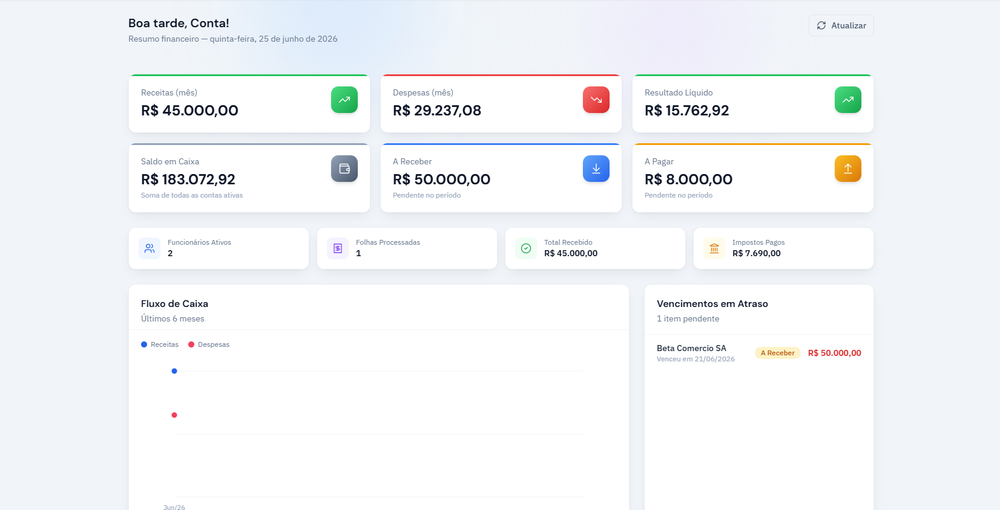
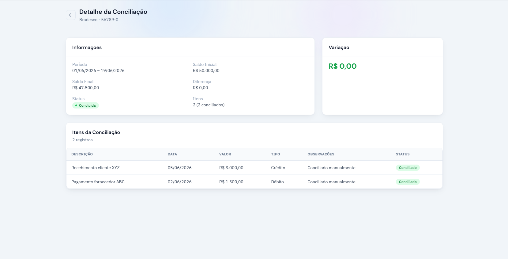
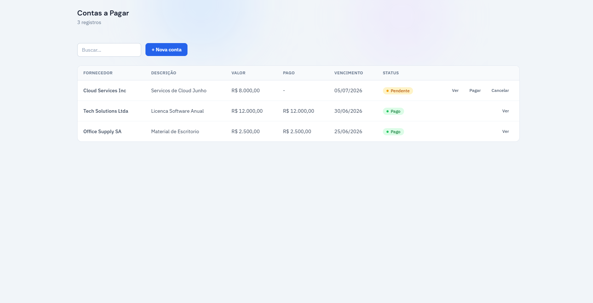
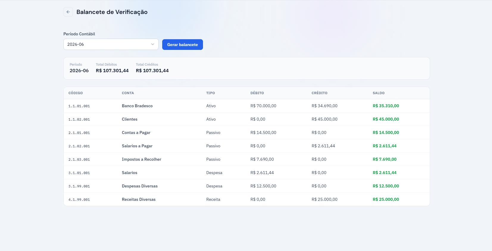
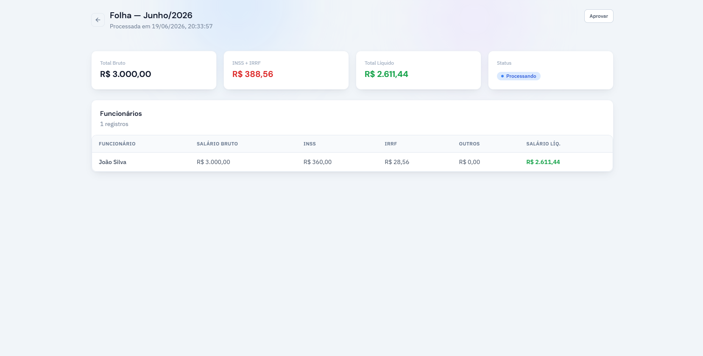
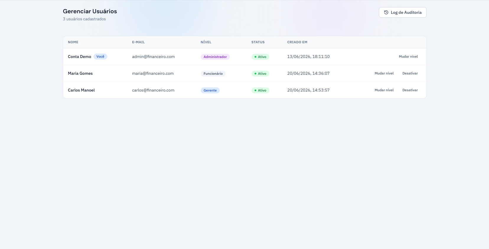

# Financeiro Web

Frontend do sistema de gestão financeira **Financeiro** — uma aplicação React/TypeScript completa para controle contábil, financeiro, bancário e de RH de uma empresa, com controle de acesso por papéis e modo escuro.

> Este é o frontend (SPA). O backend está em [`FinanceiroApi`](../FinanceiroApi).

## 📸 Screenshots

### Dashboard Executivo

<p align="center">
  
</p>

### Conciliação Bancária

<p align="center">
  
</p>

### Contas a Pagar

<p align="center">
  
</p>

### Balancete de Verificação

<p align="center">
  
</p>

### Folha de Pagamento

<p align="center">
  
</p>

### Gerênciamento de Usuários

<p align="center">
  
</p>

## ✨ O que o sistema faz

**Contabilidade**
- Plano de Contas hierárquico, Períodos Contábeis, Lançamentos Contábeis manuais e automáticos (gerados via Domain Events sempre que uma conta é paga/recebida ou uma folha é processada)
- Balancete de Verificação com validação de partida dobrada

**Financeiro**
- Contas a Pagar e a Receber com fluxo completo de baixa, gerando automaticamente Transação e Lançamento Contábil correspondentes
- Orçamentos com comparação Orçado × Realizado por Centro de Custo
- Dashboard com indicadores em tempo real, fluxo de caixa dos últimos 6 meses e cards clicáveis que levam direto à tela de origem

**Bancário**
- Múltiplas Contas Bancárias, importação de Extratos
- Conciliação Bancária completa: criação a partir do extrato importado, vinculação item a item com as transações do sistema, e finalização com validação de pendências e diferença de saldo

**RH e Folha de Pagamento**
- Departamentos e Funcionários
- Folha de Pagamento com cálculo de INSS/IRPF e fluxo de aprovação em 3 etapas (Processar → Aprovar → Pagar)

**Fiscal**
- Obrigações fiscais (ICMS, ISS, INSS, FGTS...) com registro de pagamento, multa e juros

**Controle de Acesso e Segurança**
- RBAC com 3 níveis de acesso (Employee / Manager / Admin), aplicado tanto no backend (Policies) quanto no frontend (rotas e menu adaptados por papel)
- Gerenciamento de usuários com log de auditoria completo — quem alterou o quê, e quando
- Conta de demonstração protegida contra alterações destrutivas, com login de um clique

Detalhes de produto: modo claro/escuro, tela de erro customizada.

## 🛠️ Stack

- **React 19** + **TypeScript**
- **Vite** — build tool
- **Tailwind CSS** — estilização, com suporte a dark mode (`class` strategy)
- **React Router** — roteamento com proteção de rotas por autenticação e nível de acesso, e `errorElement` customizado
- **React Hook Form + Zod** — formulários e validação
- **Axios** — comunicação com a API, com interceptors de autenticação/expiração de token
- **Lucide React** — ícones
- **Context API** — autenticação, notificações (toast) e preferências de tema
- **Vitest + Testing Library** — testes automatizados de utilitários, camada HTTP e componentes

## 🚀 Como rodar

### Pré-requisitos
- Node.js 20+
- A API ([`FinanceiroApi`](../FinanceiroApi)) rodando em `http://localhost:8080`

### Instalação

```bash
npm install
npm run dev
```

A aplicação fica disponível em `http://localhost:5173`.

### Build de produção

```bash
npm run build
```

### Type-check

```bash
npm run type-check
```

### Testes

```bash
npm run test:ci
```

## 🔑 Acesso de demonstração

Na tela de login, clique em **"Entrar com conta demo (acesso completo)"** — não é necessário digitar nenhuma credencial.

| Campo | Valor |
|---|---|
| E-mail | `admin@financeiro.com` |
| Senha | `Admin@123` |
| Nível | Administrador |

Novas contas criadas via "Criar conta" entram por padrão com nível **Employee** (não logam automaticamente — é necessário fazer login após o cadastro). Para testar os níveis Manager/Admin, use a conta demo e promova outros usuários pela tela de **Gerenciar Usuários**.

## 🔐 Estrutura de pastas

```
src/
├── components/
│   ├── ui/             # Componentes base (Button, Input, Select, Table, Modal, Card, Badge...)
│   ├── features/       # Componentes específicos de domínio (dashboard, payroll, employees...)
│   └── layout/          # Sidebar, Header, MainLayout, AuthLayout
├── pages/               # Uma pasta por módulo/tela
├── services/            # Camada de comunicação com a API (um arquivo por recurso)
├── hooks/               # Hooks customizados de dados (useEmployees, usePayroll...)
├── contexts/            # AuthContext, NotificationContext, PreferencesContext
├── schemas/             # Validação Zod por formulário
├── types/                # Tipos de domínio e enums (espelham o backend)
├── router/               # Definição de rotas, proteção por role e ErrorBoundary
└── __tests__/            # Testes automatizados (utils, services, components)
```

## ⚠️ Notas e limitações conhecidas

- Algumas listagens de referência (Plano de Contas, Períodos Contábeis) usadas em seletores de formulário solicitam explicitamente um `pageSize` maior ao consumir a API, para evitar corte de opções no dropdown
- Cobertura de testes automatizados é representativa, não exaustiva — cobre utilitários críticos (incluindo um teste de regressão para um bug de timezone já corrigido), a camada HTTP central e os componentes de UI mais usados
